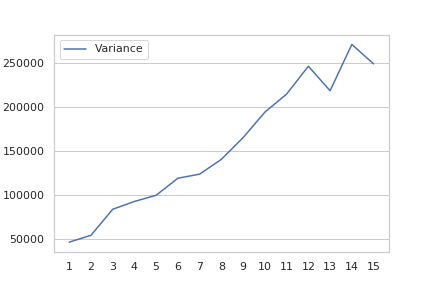

# Machine Data and Learning: Assignment 1

## Task 1: Linear Regression

### 2.1
Linear regression is used to model the relationship between 2 variables by fitting a 1 degree equation to observed data. One variable is considered to be an explanatory variable, and the other is considered to be a dependent variable. For example, we might want to relate the weights of individuals to their heights using a linear regression model. The function *LinearRegression.fit()* from *sklearn.linear_model* returns us a line of te form: $y = mx + c$ where

$y$ : predicted value (dependent variable)

$x$ : input data (explanatory variable)

The function minimises the error between the predicted value of $y$ and the actual value of $y$.It tries to find the best values for $m$ and $c$ such that the line *best fits* the input data on which the model is being trained. This is done by minimising the sum of squares of difference between the *real* and *predicted* value of $y$ ($m$ and $c$ act as variables in the equation).

## Task 2: Calculating bias and variance

### Bias:

Bias is used to measure the accuracy of the predictions made by our model. 

$Bias[y'] = E[y'-y]$ 

$y'$ : predicted value

$y$ : actual value

High bias usually means that our model is not taking certain important features into account while making predictions and this is leading to high inaccuracies when compared to the actual values. Meanwhile, extremely low bias may be caused due to overfitting being done by our model which would result in our predictions being highly accurate for the training data, but failing for testing data.

&nbsp;

&nbsp;

&nbsp;

&nbsp;

&nbsp;

### Variance: 

Variance is a measure of the precision of the predictions made.

$Variance = E[y'^2] - E[y']^2$

$y'$ : predicted value

A high variance leads to the algorithm modelling the noise from the input data. For the data provided to us, the general trend is that variance increases with increase in the degree. High variance is also exhibited if the model is overfitting for training data.

&nbsp;

&nbsp;

&nbsp;

&nbsp;

&nbsp;

&nbsp;

&nbsp;

&nbsp;

&nbsp;

&nbsp;

## Task 3: Calculating irreducible error

This is a measure of the noise exhibted in the data being used. Ideally, the value should be equal to $0$ but due to this noise existing in virtually all datasets available, there is always some error that is displayed.

&nbsp;

&nbsp;

&nbsp;

&nbsp;

&nbsp;

&nbsp;

&nbsp;

&nbsp;

## Task 4: Plotting $Bias^2 - Variance$ Graph

As we can see in the graph, the $MSE$ and $Bias^2$ are least at $x=3$, which would probably mean that the function is probably a cubic ( 3 degree ) one and that a cubic polynomial best fits the data.  

Also we notice that the bias is initially very high due to underfitting (as also mentioned before), drops to the best value, then increses again as thr model conforms too closely with the training data and the test data loses its generality.

The variance increases continuously after degree 3 because the curve best fits the training data, resulting in an inaccurate representation of the test data, while also decreasing the precision of the model.

&nbsp;

&nbsp;

&nbsp;

&nbsp;

&nbsp;

&nbsp;

&nbsp;

&nbsp;

*Made By:*

**Team Number : 24**

**Hitesh Goel (2020115003)**

**Devesh Marwah (2020115005)**